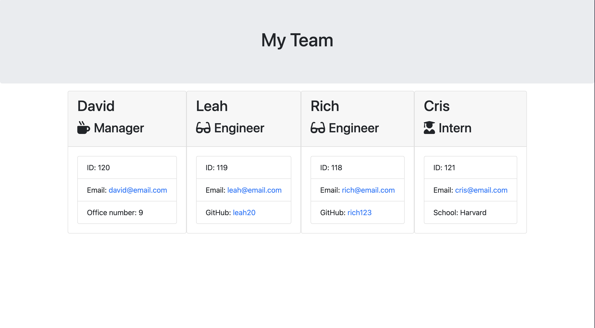

# team-profile-generator

## Description

This is a application that creates a HTML page of team members and various details about them, populated by responses to questions given to the user. The project has helped reinforce my understanding of OOP and classes.

## Installation

No installation necessary. Please delete the sample "team.html" file. Then, use your chosen terminal to open the repo directory and run the command "node index.js" to start the generator. Once finished adding your team, a "team.html" will be generated in the "output" folder. If there is no such folder, the application will create one.

## Credits

The class sessions held by the edX front-end bootcamp team have been invaluable for this challenge, especially in my understanding of object-oriented programming. Previous experience in the last challenge and class sessions with inquire/fs/module exports were also used.
